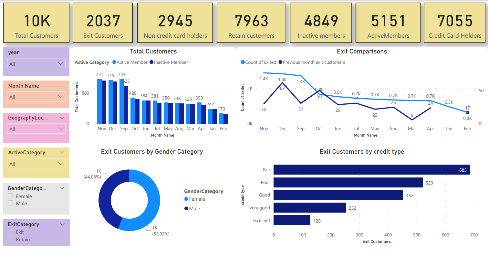
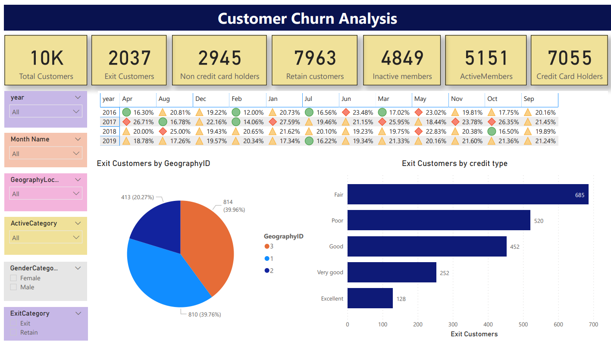

# Custome Churn Analysis - Power BI Dashboard

## Overview
As a Data Analyst, the project aims to delve into extensive datasets from both banking and telecom domains to understand customer churn dynamics. By leveraging various customer-related features such as demographics, transaction history, and activity status, the goal is to analyze patterns and build predictive models capable of forecasting customer churn. Through comprehensive data analysis, feature engineering, and model development, the project seeks to empower businesses with actionable insights to implement targeted retention strategies and enhance customer loyalty.

## Analysis Objectives
1.Identifying Key Churn Drivers
Determine which factors contribute most significantly to customer churn within the banking and telecom industries. Analyze the correlation between different customer attributes and the likelihood of churn. Identify patterns or trends that distinguish churned customers from those who remain active.
2. Segmentation of Customer Base
Segment customers based on their demographic characteristics, transactional behavior, and activity status. Explore distinct customer segments and their respective churn rates. Identify high-value segments that are more prone to churn and those that are more loyal.
3. Predictive Modeling for Churn Prediction
Develop predictive models using machine learning algorithms to forecast which customers are likely to churn in the future. Evaluate the performance of various models and select the most accurate and reliable one for deployment. Assess the predictive power of different features and their impact on model performance.
4. Customer Lifetime Value (CLV) Analysis
Calculate the CLV for different customer segments to understand the revenue potential associated with each group. Determine how churn rates affect the CLV of different customer segments. Explore strategies to maximize CLV while minimizing churn.

## Dashboard Snapshots
Churn 1

Churn 2

